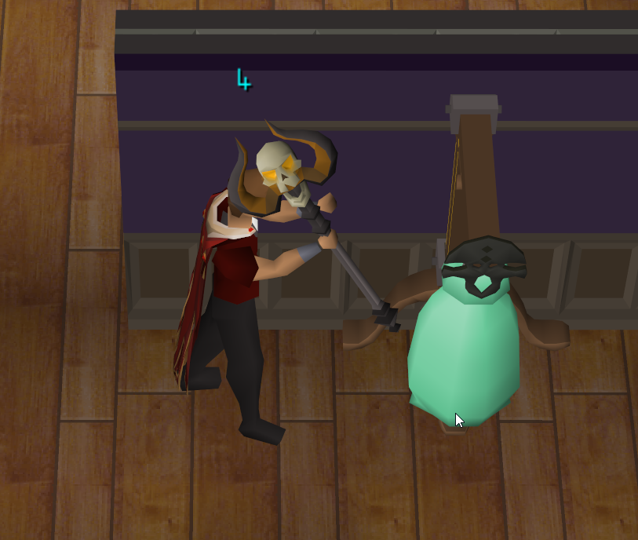
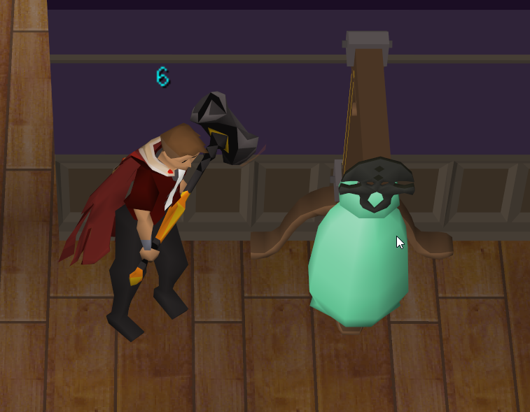
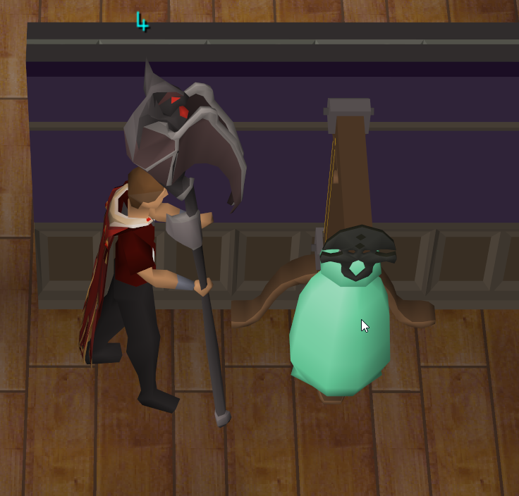

# Improved Attack Timer
A plugin to show an attack cooldown timer.

The plugin will automatically start a timer on attack. Not all weapons may be
supported (YET!) - feel free to raise an issue in
[GitHub](https://github.com/Lexer747/improvedattacktimer/issues/new?assignees=&labels=&projects=&template=missing-weapon.md&title=Missing+Weapon)
if you find a weapon or special attack which doesn't work.

Ticks until next attack may be enabled over your player's head.

## Examples:

## Why is it improved?

* Fixed many powered staves auto attacks - previously incorrectly at 5 ticks
  * Accursed, Sang (with kit), Trident (e), Crystal Gauntlet staves
* Adds Valarmore weapons (Perils of Moons/Tonalztics)
  * Also accounts for full blood moon set effect
* Adds a whole bunch of spec weapon support! Dscim, d2h - all the fun stuff 🎉

## More examples:

https://github.com/Lexer747/improvedattacktimer/assets/17512637/f439d821-3ccf-4adc-91d6-13b2d41f1d83

### Testing

There's still work to do to bring this plugin up to perfect standards:

* Test Brine saber spec
* Nightmare staff specs
* Dawn bringer auto and spec

### Known issues

* rat weapons at Scurrius having no delay isn't accounted for
* 1 ticking the weapon on the first tick will give you the delay of the
  un-equipped weapon

Every new game update needs a manual update with the new items, this isn't
sustainable - figure out a way to implement them without owning them. Or even
better simply picked up information from the client.

Forked from https://github.com/ngraves95/attacktimer
